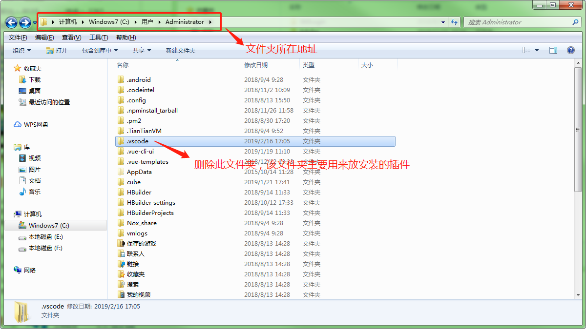
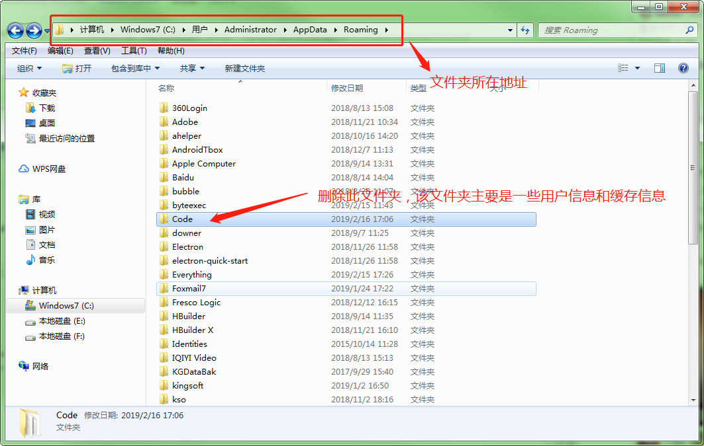

# VSCode 插件

## vscode 插件使用 Settings Sync 扩展进行统一管理

1. vscode 应用商店中搜索 `Settings Sync` 安装该插件, 安装后重新加载
1. 按`F1` 输入 `sync: 高级选项`, 选中后, 选择`从公开的Gist下载设置`.
1. 按 `Shift + Alt + D` 输入 Gist id `9bfa512e331bf1e31494f10a1a567dc1`, 等待下载完成, VsCode 插件 以及设置同步成功.
1. 之后可以下载自己所需要的个性的插件或配置设置,`格式化类设置不建议修改`,有推荐的插件可以联系我们加入到 gist , 一键同步

## 插件说明

```json
auto-close-tag: "自动闭合标签",
auto-rename-tag: "自动重命名标签",
code-settings-sync: "插件配置同步",
EditorConfig: "编辑器设置相关",
html-css-class-completion: "class 自动完成",
JavaScriptSnippets: "代码片段",
markdown-all-in-one: "markdown 支持",
markdown-pdf: "md转pdf",
path-intellisense: "引用路径提示" ,
prettier-vscode: "代码格式",
ReactSnippets: "React代码片段",
stylelint: "样式校验",
vscode-babel-coloring: "es6, es7语法高亮",
vscode-color: "颜色选择器",
vscode-eslint: "ESlint",
vscode-html-css: "html的css支持",
vscode-icons: "文件Icon",
vscode-jest: "FaceBook JS测试框架",
vscode-react-create: "创建react组件",
vscode-svgviewer: "svg预览",
vscode-versionlens: "依赖包版本号",
gitlens: "git插件,支持可视化git操作"
```

## 设置说明

```json
{
  "javascript.validate.enable": false,
  "editor.snippetSuggestions": "top",
  "emmet.triggerExpansionOnTab": true,
  "workbench.iconTheme": "vscode-icons",
  "git.confirmSync": false,
  "git.enableSmartCommit": true,
  "workbench.startupEditor": "newUntitledFile",
  "vsicons.dontShowNewVersionMessage": true,
  "sync.gist": "9bfa512e331bf1e31494f10a1a567dc1",
  "sync.lastUpload": "2018-08-24T06:52:10.217Z",
  "sync.autoDownload": false,
  "sync.autoUpload": false,
  "sync.lastDownload": "2018-05-12T05:36:37.854Z",
  "sync.forceDownload": false,
  "sync.anonymousGist": false,
  "sync.host": "",
  "sync.pathPrefix": "",
  "sync.quietSync": false,
  "sync.askGistName": false,
  "files.autoSave": "off",
  "explorer.confirmDelete": false,
  "sync.removeExtensions": true,
  "sync.syncExtensions": true,
  "markdown.extension.orderedList.marker": "one",
  "eslint.enable": true,
  "eslint.autoFixOnSave": true,
  "eslint.run": "onType",
  "eslint.options": {
    "extensions": [".js", ".vue"]
  },
  "eslint.validate": [
    "javascriptreact",
    "vue",
    "javascript",
    {
      "language": "vue",
      "autoFix": true
    },
    "html",
    {
      "language": "html",
      "autoFix": true
    }
  ],
  "eslint.packageManager": "yarn",
  "editor.formatOnSave": true,
  "javascript.updateImportsOnFileMove.enabled": "always"
}
```

## 快捷键

```
1. 上传设置 : Shift + Alt + U (本GIst只读, 暂时用不上,有好的插件可以联系我们更新gist)
2. 下载设置 : Shift + Alt + D
```

> 清空插件和设置方法

> 找到下图中文件夹的目录，然后将之删除，即可彻底清除已安装的插件个个人配置信息




